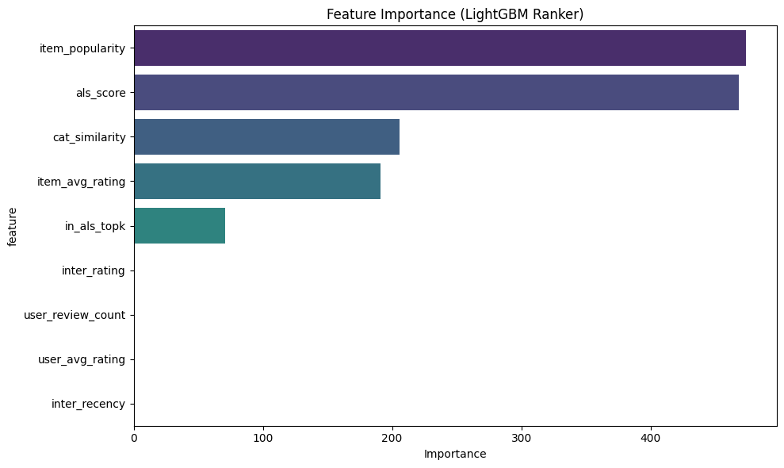
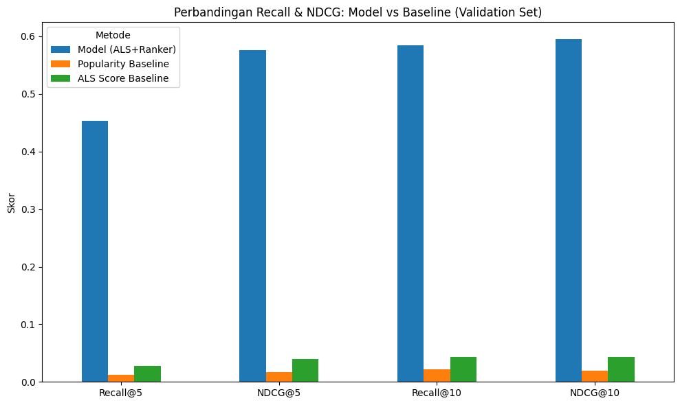

# Merchant Recommendation & Ranking
### Recommender System + Learning to Rank


> This project builds a two-stage merchant recommendation system: candidate generation (narrowing thousands of merchants down to 100 relevant candidates per user) followed by ranking (ordering those 100 candidates by how likely the user is to actually transact with them). Stage 1 uses ALS on user-merchant rating history, stage 2 uses a LightGBM Ranker that combines the ALS score with other signals like popularity, rating, and category closeness. Every number in this README comes from a validation set split at the user level (0% overlap with training data), so it represents model performance on users the model has never seen during training. Headline result: the model places at least 1 relevant merchant in the Top 5 for **83.2% of users** (vs. 6.2% using popularity ranking alone), equivalent to a **~3,470% lift in Recall@5**.

## Table of Contents

1. [Background & Business Questions](#1-background--business-questions)
2. [Data Source](#2-data-source)
3. [Methodology](#3-methodology)
4. [Tech Stack](#4-tech-stack)
5. [How Each Algorithm Works](#5-how-each-algorithm-works)
6. [How Results Are Measured](#6-how-results-are-measured)
7. [Results & Key Insights](#7-results--key-insights)
   - [7.1 BQ1: Most relevant merchant per user](#71-bq1--most-relevant-merchant-per-user)
   - [7.2 BQ2: Effect of ranking on transaction likelihood](#72-bq2--effect-of-ranking-on-transaction-likelihood)
   - [7.3 BQ3: Most influential features](#73-bq3--most-influential-features)
   - [7.4 BQ4: Relevance lift vs. baseline](#74-bq4--relevance-lift-vs-baseline)
8. [Recommendations](#8-recommendations)
9. [Limitations & Constraints](#9-limitations--constraints)
10. [How to Run](#10-how-to-run)
11. [Project Structure](#11-project-structure)
12. [Future Work](#12-future-work)
13. [References](#13-references)

## 1. Background & Business Questions

Industrial-scale recommendation systems rarely rely on a single model. The common pattern is a two-stage pipeline:

1. **Candidate generation**: narrow millions of merchants down to tens or hundreds of candidates relevant to a given user.
2. **Ranking**: order those candidates by how likely the user is to actually transact.

This two-stage pattern matches what large platforms like Netflix, Pinterest, and Amazon use, and its theoretical properties, including convergence toward an optimal recommender system, are now being studied formally (Jaiswal, 2024). This project builds both stages using real marketplace transaction data (the Yelp Dataset), then adapts the approach to a merchant-recommendation context for a payment app.

Four questions this project answers:

| # | Question |
|---|---|
| BQ1 | Which merchants are most relevant to recommend to each user, based on their transaction history? |
| BQ2 | How does the ranking of recommendations affect the likelihood a user actually transacts, compared to ranking by popularity alone? |
| BQ3 | Which features (merchant rating, category closeness, transaction recency, etc.) most influence the ranking? |
| BQ4 | How much does the model improve relevance over a simple baseline? |

## 2. Data Source

Source: [Yelp Open Dataset](https://www.yelp.com/dataset/download) (`yelp_academic_dataset_business.json`, `yelp_academic_dataset_review.json`). The review file is large (>5GB), so data is read in chunks (streaming) and filtered immediately to save memory.

Data preparation steps:

1. Cities are auto-filtered to the 2 cities with the most businesses in the dataset: Philadelphia and Tucson.
2. Merchants with `review_count < 10` are dropped.
3. Users with fewer than 5 reviews are dropped, to avoid extreme cold-start cases.
4. Data is split by time: transactions before 2018-01-01 for training, everything after for test.

| Stage | Count |
|---|---|
| Total businesses (raw) | 150,346 |
| Businesses used (2 cities, review_count ≥ 10) | 16,642 |
| Total review rows scanned | 6,990,280 |
| Reviews used after filtering | 820,107 |
| Review date range | 2005-03-02 to 2022-01-19 |
| Train+test users (after activity filter) | 23,096 |
| Unique items | 16,461 |
| Ranking data rows (positive + negative sampling) | 4,771,946 |

## 3. Methodology

**In plain terms:** this project works in two stages, similar to a hiring process. The first stage narrows thousands of merchants down to 100 candidates that roughly fit each user, like narrowing thousands of job applications down to 100 candidates worth calling in for an interview. The second stage ranks those 100 candidates from most to least likely to actually be transacted with by the user, like a final interview round that decides the order in which candidates deserve an offer.

**Stage 1: Candidate Generation (ALS).** A user × merchant interaction matrix (rating) is built from `train_df`, trained with `implicit.AlternatingLeastSquares` (factors=50, iterations=20). Each user gets the top 100 candidates from ALS.

**Stage 2: Ranking (LightGBM LambdaRank).** Candidates from ALS are combined with popular items and random samples as negatives, then given 9 features. Choosing a GBDT model (LightGBM) as the ranker here is consistent with findings that tree-based models (GBDT/Random Forest) still outperform deep learning on medium-sized tabular data, which matches the ranking data in this project (Grinsztajn et al., 2022):

| Feature | Description |
|---|---|
| `item_popularity` | Number of merchant reviews |
| `item_avg_rating` | Merchant's average rating |
| `user_avg_rating` | User's average given rating |
| `user_review_count` | Number of reviews the user has written |
| `inter_rating` | User's rating for that merchant, if they've interacted before |
| `inter_recency` | Days since the last interaction |
| `cat_similarity` | Category similarity (TF-IDF cosine similarity) between the user's history and the merchant |
| `als_score` | Dot-product score from the ALS model |
| `in_als_topk` | Whether the merchant is in ALS's top-100 recommendations |

**In plain terms, these 9 features answer:** "how popular is this merchant", "how good is its rating", "how similar is its category to what this user usually buys", and "how close is this merchant to the user's hidden preferences according to Stage 1". The model learns the weight of each factor from historical data, rather than having them set manually.

**Validation.** `df_rank` is split at the user level (not the row level), 80/20, into `df_rank_train` (18,476 users, 3,816,943 rows) and `df_rank_val` (4,620 users, 955,003 rows), with 0 user overlap between the two. The model is trained with `objective='lambdarank'`, with early stopping based on `ndcg@10` on the validation set. All BQ1–BQ4 metrics are calculated on `df_rank_val`: data the model never saw during training.

**Why this matters for the business:** the model is tested on 4,620 users it never "saw" while learning, so the reported performance numbers reflect real conditions with new users, not just how well the model memorized users it already knows.

## 4. Tech Stack

Python · Pandas · implicit (ALS) · LightGBM Ranker · scikit-learn

## 5. How Each Algorithm Works

**ALS (Alternating Least Squares).** Its job: find the hidden patterns in a very sparsely-filled user × merchant rating matrix that explain why a user likes a particular merchant.

**In plain terms:** imagine every user and every merchant has a "taste fingerprint" made of 50 secret numbers that captures why user A tends to like merchant X. The model learns this fingerprint from transaction history, then matches user fingerprints against merchant fingerprints to guess who fits best. For readers who want the math:

The original rating matrix `R` is decomposed into two smaller matrices:

```
R ≈ P × Qᵀ
```

`P` (sized users × factors) represents each user's preferences, `Q` (sized merchants × factors) represents each merchant's characteristics, both in 50 latent dimensions (`factors=50`). The predicted score for user `u` on merchant `i` is computed as a dot product:

```
als_score(u, i) = P_u · Q_i
```

ALS trains `P` and `Q` by alternating: freeze `Q`, find the best `P` via least squares, then freeze `P`, find the best `Q`, repeated 20 times (`iterations=20`) until the error shrinks. This is what produces the 100 rough candidates per user in Stage 1.

**LightGBM LambdaRank.** Unlike a standard classification model that scores each merchant independently, this learns from **pairs** of merchants per user: if merchant A was actually transacted with by the user and merchant B wasn't, the model gets penalized for ranking B above A.

**In plain terms:** this model isn't trained to guess "will this merchant be transacted with, yes or no" one at a time. It's trained directly to guess the correct order, like training a competition judge to rank contestants from best to worst, not just mark each one pass or fail. The penalty is weighted more heavily for mistakes near the top of the ranking (close to rank 1) than near the bottom, because the top positions shape the user's experience the most (a merchant in the top 5 gets seen far more often than one at rank 50). The effect: the model is optimized directly for ordering, not just for a per-merchant score. Recent comparisons of LambdaMART and other GBDT ranking variants show that position-based weighting like this remains a key part of what makes the best current GBDT ranking methods work (Lyzhin et al., 2022).

## 6. How Results Are Measured

These four metrics are calculated per user on the validation set, then averaged:

**Recall@K**: of all the merchants a user actually transacted with, what percentage made it into the top K recommendations.

```
Recall@K = (relevant merchants in top-K) / (total relevant merchants for that user)
```

*In other words:* if a user actually transacted with 4 different merchants, and 2 of those 4 show up in the top 5 recommendations, that user's Recall@5 = 50%.

**Precision@K**: of the K recommendations shown, what percentage are actually relevant.

```
Precision@K = (relevant merchants in top-K) / K
```

*In other words:* out of the 5 merchants shown to a user, how many actually "hit the mark". This measures how much of each recommendation slot goes to waste.

**Hit Rate@K**: whether at least one relevant merchant appears in the top K (1 if yes, 0 if no), averaged across users.

```
Hit Rate@K = 1 if (relevant merchants in top-K) > 0, otherwise 0
```

*In other words:* the simplest possible metric, "did this user see at least one recommendation that fit them, yes or no". This is the easiest metric to explain to a non-technical stakeholder: 83.2% means 8 out of 10 users saw at least one relevant recommendation in the top 5.

**NDCG@K (Normalized Discounted Cumulative Gain)**: measures relevance and position together, a relevant merchant appearing at rank 1 is worth more than one appearing at rank 10.

```
DCG@K  = Σ (relevance_i / log2(i + 2))     for i = 0 ... K-1
NDCG@K = DCG@K / IDCG@K
```

*In plain terms:* Recall and Precision only count "how many hit", they don't care about position. NDCG cares about position too, a correct recommendation sitting at position 1 is worth far more than a correct one buried at position 10, because users rarely scroll that far. `relevance_i` is 1 if the merchant at position `i` was actually transacted with by the user, 0 if not. `IDCG@K` is the score from the ideal ordering (every relevant merchant placed at the very top), so NDCG always falls between 0 and 1, with 1 meaning the model's ordering matches the ideal ordering exactly.

## 7. Results & Key Insights

### 7.1 BQ1: Most relevant merchant per user

Across the 4,620 users in the validation set, the model placed at least 1 merchant the user actually transacted with in the Top 5 recommendations for **83.2% of users** (Hit Rate@5), compared to just **6.2% of users** using popularity ranking alone.

Model Precision@5 = **0.3910** (of the top 5 recommendations, an average of 1.95 are actually relevant) vs. popularity Precision@5 = **0.0149**.

### 7.2 BQ2: Effect of ranking on transaction likelihood

Model NDCG@5 = **0.5761** vs. popularity NDCG@5 = **0.0173** on the validation set. The model's ordering places merchants the user actually transacted with much closer to the top (ranks 1–5) than popularity-based ordering does, users see relevant merchants for them much sooner.

Three example users from the validation set (chosen at random for illustration, not as the basis for the main conclusion, BQ2's conclusion uses the averages above):

| User | Model NDCG@5 | Popularity NDCG@5 | Verdict |
|---|---|---|---|
| `1Z5m2Pzw...` | 0.441 | 0.000 | Model wins |
| `52nYCf9C...` | 0.000 | 0.000 | Tied, neither surfaces a relevant item |
| `Zo3K-CTw...` | 0.830 | 0.000 | Model wins |

### 7.3 BQ3: Most influential features



The top three features: `item_popularity` (474), `als_score` (468), `cat_similarity` (206), followed by `item_avg_rating` (~190) and `in_als_topk` (~70). The other four features, `inter_rating`, `user_review_count`, `user_avg_rating`, `inter_recency`, have importance close to zero. Only 5 of the 9 features are actually being used by the model.

The model relies mostly on merchant characteristics (popularity, rating) and the ALS collaborative signal (the user's historical preferences), not on user-level features (average user rating, user review count) or recency. This matters if the next goal is improving recommendations for infrequent transactors, the features that should help with that case are currently underused by the model.

### 7.4 BQ4: Relevance lift vs. baseline

| Metric | Model (ALS+Ranker) | Popularity Baseline | ALS Score Baseline |
|---|---|---|---|
| Recall@5 | 0.4532 | 0.0127 | 0.0272 |
| NDCG@5 | 0.5761 | 0.0173 | 0.0397 |
| Recall@10 | 0.5846 | 0.0215 | 0.0438 |
| NDCG@10 | 0.5948 | 0.0199 | 0.0434 |



On the validation set, the model gains **~3,470%** in Recall@5 and **~3,229%** in NDCG@5 over the popularity baseline. A percentage this large is mathematically expected because the baseline itself is very small (popularity Recall@5 is just 0.0127), that isn't a sign of an error, but it also means this percentage hasn't yet been backed by a statistical significance test (see Limitation #3). This large uplift makes business sense too: the popularity baseline offers the same generic merchant list to every user, while user preferences in this dataset are highly specific and varied, so that baseline was always going to struggle to guess the right merchant for any given individual.

The ALS Score Baseline (raw ALS score without the ranker) also falls well short of the full model, a sign that the ranking layer (LightGBM) adds significant value on top of candidate generation alone.

## 8. Recommendations

1. Re-investigate the user-level features (`user_review_count`, `user_avg_rating`, `inter_recency`) through re-engineering, such as normalization or binning, so the tree-based model can pick up on them better.
2. Add a statistical significance test (for example, a bootstrap confidence interval) on the gap between model and baseline metrics, to strengthen the uplift claim, especially before a number like "+3,470%" gets quoted outside the context of this report.
3. Double-check city coverage: the automatic filter produced Philadelphia and Tucson. If the project's actual target is a specific city, confirm that city genuinely isn't present in this version of the dataset.

## 9. Limitations & Constraints

1. The automatic city filter (top 2 by business count) produced Philadelphia and Tucson, not a manually chosen city.
2. Only 5 of the 9 features actually contribute to the model (see BQ3); user-level features are barely used.
3. There's no statistical significance test yet on the gap between model and baseline metrics, the uplift percentages in BQ4 (e.g. +3,470%) look large in relative terms because the baseline is small, and there's no confidence interval behind them yet.

## 10. How to Run

```bash
pip install pandas numpy scipy scikit-learn implicit lightgbm tqdm matplotlib seaborn --break-system-packages
```

1. Download the dataset from the [Yelp Open Dataset](https://www.yelp.com/dataset/download) and place it in the `./data/` folder.
2. Open `rekomendasi_merchant.ipynb`.
3. Run all cells from top to bottom (Run All). Candidate generation + feature building can take over an hour depending on machine specs, watch the `tqdm` progress bar at each stage.

## 11. Project Structure

```
rekomendasi_merchant.ipynb   -> main notebook: candidate generation (ALS), ranking (LightGBM LambdaRank), BQ1-BQ4 evaluation
assets/                      -> evaluation charts for the README
data/                        -> Yelp dataset files (not included in the repo)
```

## 12. Future Work

1. Cross-check results with different time cutoffs (sensitivity check against `TRAIN_CUTOFF`).
2. Add user segmentation analysis (active vs. infrequent transactors), to see whether the model's edge holds across all segments, especially since the BQ3 finding suggests the model may be less optimal for users with thin history.

## 13. References

Jaiswal, A. K. (2024). *Towards a theoretical understanding of two-stage recommender systems* (arXiv:2403.00802). arXiv. https://arxiv.org/abs/2403.00802

Grinsztajn, L., Oyallon, E., & Varoquaux, G. (2022). Why do tree-based models still outperform deep learning on typical tabular data? In *Advances in Neural Information Processing Systems* (Vol. 35, pp. 507–520). Curran Associates, Inc. https://proceedings.neurips.cc/paper_files/paper/2022/hash/0378c7692da36807bdec87ab043cdadc-Abstract-Datasets_and_Benchmarks.html

Lyzhin, I., Ustimenko, A., Gulin, A., & Prokhorenkova, L. (2022). *Which tricks are important for learning to rank?* (arXiv:2204.01500). arXiv. https://doi.org/10.48550/arXiv.2204.01500